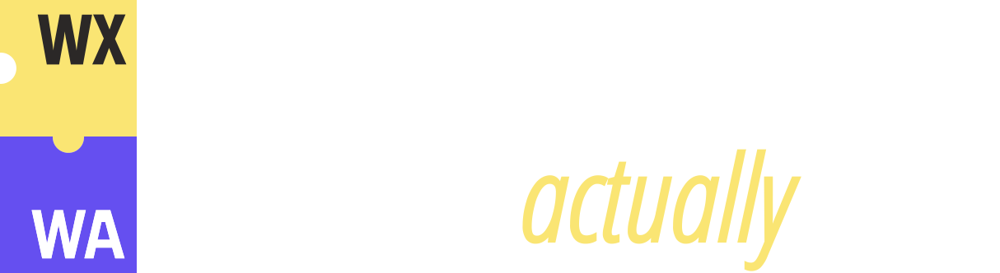

<p align="center">
  <picture>
    <source media="(prefers-color-scheme: dark)" srcset="banner.svg">
    <source media="(prefers-color-scheme: light)" srcset="banner-light.svg">
    
  </picture>
</p>

<h1 align="center">
WX - Web Assembly Expressive Language
</h1>

> [!WARNING]
> The project was moved from my personal repository to the [wxlanguage](https://github.com/wxlanguage) organization.

WX is a Rust-inspired language that compiles directly to WebAssembly. It stays close to the WASM spec instead of hiding it, so the code you write maps predictably onto the module you get — no hidden runtime, no GC, no surprises.

This project is part of my bachelor's thesis exploring what it takes to build a full WASM compiler from scratch. It's still early — expect rough edges.

## Features

- Rust-inspired syntax: structs, traits, generics, `impl` blocks, pattern-free control flow
- Compiles straight to WASM bytecode, with a low-abstraction, spec-aligned type system
- Generics with monomorphization, `#[inline]`, dead-code elimination, and sea-of-nodes optimization passes
- Multi-file modules, WASM imports/exports, and `#[intrinsic]` bindings for memory ops
- Tooling: an LSP with diagnostics/completions/formatting, and a VS Code extension

## Getting Started

Try it instantly in the browser playground: [wx-lang.deno.dev](https://wx-lang.deno.dev/)

**Install the CLI from npm**

```bash
npm install -g @wx-lang/cli

wx compile ./main.wx
```

**Or build the native CLI from source**

```bash
cargo build --release -p wx-cli
./target/release/wx compile ./main.wx
```

**Editor support**

Search for "WX" in the VS Code Extensions view for syntax highlighting, diagnostics, completions, and formatting. Other editors aren't supported yet.

## Examples

Sample programs live in the [`examples`](examples) directory.

## Architecture


## Credits

Here are some of the resources I used to learn about compilers and wasm while working on this project:

- [Julian Hartl (natrixcc)](https://github.com/julian-hartl/natrixcc) - I learned a lot by digging into the source code of this project.
- [tylerlaceby](https://www.youtube.com/@tylerlaceby) - Great youtube channel where I learned a lot about how to write lexers and parsers.
- [Jon Gjengset](https://www.youtube.com/@jonhoo) - Another great author that has a lot of content about Rust with deep dives into the language internals.
- Blog posts and conference talks by [Andrew Kelley](https://github.com/andrewrk), the creator of the Zig.
