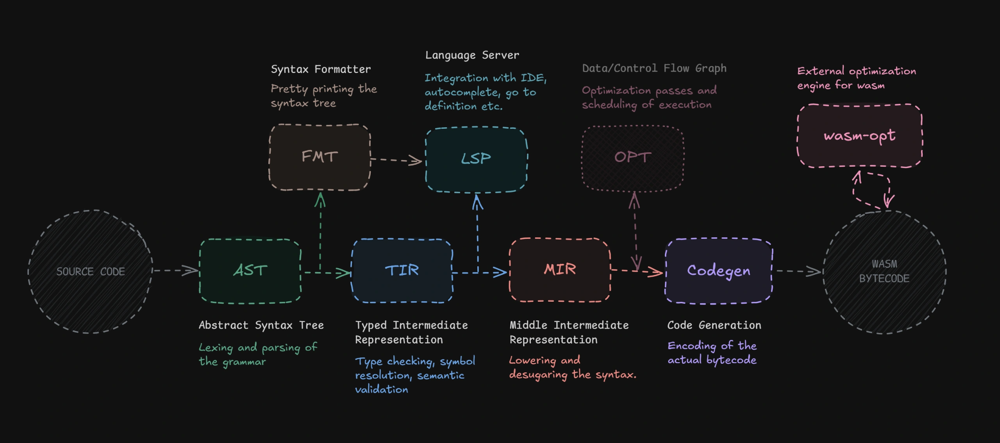

# Web Assembly Expressive Language (WX)

This project is part of my bachelor’s thesis and aims to explore the possibilities of WASM while diving into building a full-blown compiler. It is still in very early stage, so I don't guarantee anything will work at all.

## Design Philosophy

The main goal of this language is to simplify writing WASM modules while closely reflecting the underlying WASM specification in a more high-level, approachable way. Ideally, the language should teach you how WASM works but keep the convenience of a high level language.

## Getting Started

The easiest way is to install the compiler cli from npm. Or check out the playground here: [wx-lang.deno.dev](https://wx-lang.deno.dev/)

```bash
npm install -g wx-compiler

wx-compiler ./main.wx
```

> [!NOTE]
> You will see this warning after compilation. This is because cli imports wasm modules directly, which is currently [not stable](https://nodejs.org/api/esm.html#wasm-modules) in Node.js.
>
> ```
> (node:37243) ExperimentalWarning: Importing WebAssembly modules is an experimental feature and might change at any time
> ```

You can also access compiler functionality directly with `wx-compiler-wasm` package.

```ts
import { compile } from "wx-compiler-wasm";

const bytecode: Uint8Array = compile("main.wx", `
    import "console" {
        fn log(message: string); 
    }

    fn main() {
        console::log("Hello World!");
    }

    export { main }
`);
```

Alternatively, you can build the compiler from source with the following command:

```bash
cargo build --release -p wx-compiler-cli
./target/release/wx-compiler-cli ./main.wx
```

## Syntax and Semantics

The syntax is strongly inspired by Rust. I don't have a goal to create something completely new, but rather a language that is familiar and easy to start with.

### Types

Currently the language supports the following types:

- `i32` - 32-bit signed integer
- `i64` - 64-bit signed integer
- `u32` - 32-bit unsigned integer
- `u64` - 64-bit unsigned integer
- `f32` - 32-bit floating point number
- `f64` - 64-bit floating point number
- `string` - a "fat-pointer" type that holds a memory offset and a length of the string data in linear memory
- `bool` - true or false
- `unit` - empty type, used for functions that don't return a value
- `never` - a type with no values, representing the result of computations that never complete

### Untyped Literals

When you define an integer literal, it doesn't have a type by itself. Instead, the context of the expression determines the type. So, when you define a variable like this:

```rust
local x = 5; // error: type annotation is required
local x: i32 = 5; // ok
local x = 5 as i32; // ok
```

`as` expression can be used to provide the context for the expected type.

### Variables

Local variables are variables that are defined within a function or a block and are not accessible outside of it. They can be either mutable or immutable.

```rust
local x: i32 = 5; // local immutable variable
local mut y: i32 = 10; // local mutable variable
```

You can't declare a variable without initializing it, so the following is not allowed:

```rust
local x: i32; // error
local x: i32 = 0; // ok
```

The type annotation is not required in case when the type can be inferred from the initializer value:

```rust
local x: i32 = 5;
local y = x; // not required to specify type, it will be inferred as i32
```

### Block expression

Blocks are expressions that group statements together. They are defined using curly braces `{}`. The last expression in a block is the value of the block.

This is basically the same as in Rust. I decided to take this approach because it clearly reflects the nature of stack based executation of WASM, where the last value pushed to the stack is the result of the block.

```rust
local x = {
    local x: i32 = 5;
    x + 2 // this is the result value of the block
};
```

Semicolons are required to separate statements.

Block doesn't necessarily have to return a value. The type of such block will be `unit`.

```rust
local x = {
    local x: i32 = 5;
    x + 2; // this is a statement, not an expression
}; // type of x will be unit
```

There are two types of statements:

- Delimited expression - `foo();` any expression and semicolon
- Definition - `local x: i32 = 5;`

Delimited expressions can't return a non empty value, so this means that every value should be consumed or assigned to a variable. If you don't need a value, you can drop it by assigning to `_`;

```rust
_ = foo();
```

### If expressions

If expressions are used to conditionally execute code based on a boolean expression. They can return a value.

```rust
local x: i32 = if 5 > 2 { 5 } else { 2 };

if true { return 5 };
```

### Loops

Currently thre's only one type of loop available, which is just indefinite loop. It can be used to create a loop that runs forever or until a `break` expression is encountered.

```rust
loop {
    // do something
    if some_condition { break } // break out of the loop
}
```

Loops can return a value. You can do this by speficiying the value after break;

```rust
local i = 0;
local x = loop {
    if i > 10 { break i } // break out of the loop and return the value of i
    i += 1;
};
```

You can also use `continue` expression to skip the current iteration and continue with the next one.

### Labels

Labels are markers for blocks, that can be used to break out of nested loops or blocks. They are defined using the `outer:` syntax, where `outer` is the name of the label.

```rust
outer: {
    inner: {
        break :outer
    }
}
```

Labels can be used with plain blocks, loops and if expressions. Only loops don't require an explicit label for breaking out of them, the first enclosing loop will be used as the target for the `break` expression. You can also compine breaking with value and label `break :label 5`;

### Functions

Functions are defined using the `func` keyword. They can have parameters and a return type. If the return type is not specified, it defaults to `unit`(no return value).

```rust
fn add(a: i32, b: i32) -> i32 {
    a + b
}
```

### Export block

To export function or a global variable, you can use the `export` block. You can export multiple items in a single block.

```rust
fn main() -> i32 {
    2 + 2
}

global PI: f64 = 3.14159265359;

export { main, PI as "PI_CONST" }
```

## Examples

You can find some examples in the `examples` directory. Here are some of them:

- [fibonacci.wx](examples/fibonacci.wx) - A simple fibonacci function.
- [factorial.wx](examples/factorial.wx) - A simple factorial function.
- [pow.wx](examples/pow.wx) - A simple power function.
- [func_pointers.wx](examples/func_pointers.wx) - An example of using function pointers.
- [globals.wx](examples/globals.wx) - An example of using global variables.

## Architecture



## Plans for the future

- [x] Global variables
- [x] Add support for more types, like `f32`, `f64`, `u32`, `u64`
- [ ] Pattern matching
- [x] Add support for imports
- [ ] Memory: Pointers, arrays, slices, structs...
- [x] Tooling: LSP, Formatter, Syntax highlighting
- [ ] More optimizations, like constant folding etc.

## Credits

Here are some of the resources I used to learn about compilers and wasm while working on this project:

- [Julian Hartl (natrixcc)](https://github.com/julian-hartl/natrixcc) - I learned a lot by digging into the source code of this project.
- [tylerlaceby](https://www.youtube.com/@tylerlaceby) - Great youtube channel where I learned a lot about how to write lexers and parsers.
- [Jon Gjengset](https://www.youtube.com/@jonhoo) - Another great author that has a lot of content about Rust with deep dives into the language internals.
- Blog posts and conference talks by [Andrew Kelley](https://github.com/andrewrk), the creator of the Zig.
