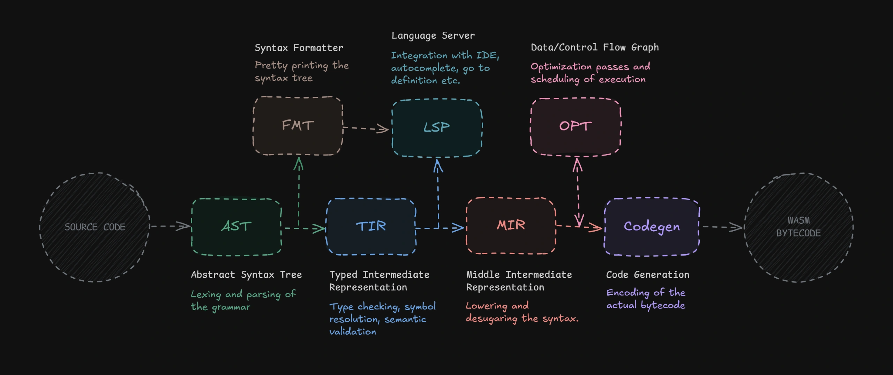

## 4.1 Implementation Context

The compiler is implemented in Rust. Development began with a prototype sketched in TypeScript — a familiar language that allowed early experimentation with parsing concepts without committing to a full implementation. It quickly became clear, however, that TypeScript was ill-suited for this domain. The lack of fine-grained numeric types and limited control over memory representation made low-level encoding work unnecessarily cumbersome. Rust offered the necessary control while its strong static guarantees proved valuable when working across multiple intermediate representations that share data structures throughout the pipeline.

Throughout the pipeline, identifiers and other frequently repeated strings are managed through a string interner provided by an external crate. Rather than allocating and comparing raw strings at each stage, the interner assigns each unique string a compact numeric key on first encounter, reducing identifier comparison to an integer equality check and eliminating redundant heap allocations. This infrastructure is shared across all stages and is established before the pipeline begins.

## 4.2 Pipeline Overview

Before the pipeline took its current shape, the Rust and Zig compiler architectures were studied as reference points. Both employ multi-stage intermediate representation strategies, and observing this pattern in mature, production compilers provided early validation that separating compilation into distinct stages was a sound approach. Rather than directly copying either structure, these served as confirmation that the direction being taken independently was reasonable.

The pipeline itself was not designed upfront as a complete specification. It evolved iteratively throughout development, with each stage introduced in response to concrete engineering challenges encountered along the way. The core principle that emerged from this process is the separation of concerns between transformation stages — attempting to combine multiple kinds of transformations into a single pass consistently introduced complexity and bugs, and each time a new stage was introduced to isolate a specific responsibility, the surrounding code became significantly simpler.

A further motivation for the multi-stage design was the goal of building a reusable compiler infrastructure rather than a monolithic translation tool. The pipeline is designed so that tooling components — the formatter and the language server — can attach at specific intermediate stages and reuse the compiler's own data structures, rather than operating as separate post-processing tools. This required deliberate thinking about what information each stage must preserve.

As shown in Figure X, the pipeline proceeds from source code through several intermediate representations before producing WASM bytecode. A meaningful architectural boundary exists between the TIR and MIR stages. Everything up to and including TIR is source-aware — intermediate representations at these stages preserve text spans, which are links back to exact positions in the original source file. From MIR onward, text spans are deliberately discarded and the pipeline concerns itself purely with transformation and output correctness. This boundary determines where each tool attaches: the formatter operates on the AST, and the language server on the TIR, both of which retain the source position information their features require.

## 4.3 Frontend — Lexer & Parser (AST)

The frontend is responsible for transforming raw source text into an Abstract Syntax Tree — a structured representation of the program that closely mirrors the original source code. It consists of two sequential stages: the lexer, which breaks source text into a stream of tokens, and the parser, which consumes that stream and constructs the AST.

### Lexer

The lexer's responsibility is classification — identifying token boundaries and assigning each token a kind. An early design decision concerned how much information to store in each token. An initial approach stored interpreted values directly in the token structure — for example, an integer token would carry both its source span and the already-parsed numeric value. This proved unnecessary and introduced parsing logic into a stage where it did not belong. Moving value interpretation downstream to the parser, which has access to surrounding context, resulted in a simpler token representation with a smaller memory footprint and a cleaner boundary between the two stages.

### Parser design — hand-written over generated

Rather than specifying the grammar using a formal notation such as Backus-Naur Form and generating a parser from it, the decision was made to write the parser by hand. Generated parsers introduce an external dependency and typically produce generic AST structures that do not integrate cleanly with a pipeline designed to share representations across compilation, formatting, and language server features. More importantly, a hand-written parser gives direct control over diagnostic quality — error messages can be tailored to the specific grammar and context, rather than being generic parse failures. The added implementation cost was considered worthwhile given these benefits.

### Pratt parsing

Parsing expressions — particularly handling operator precedence correctly — is one of the more subtle challenges in writing a parser by hand. The technique adopted here is Pratt parsing, originally introduced by Vaughan Pratt in 1973, which offers an elegant solution to this problem without requiring explicit grammar rules for each precedence level.

The central concept is binding power: each operator is assigned a numeric strength that determines how tightly it binds to its operands. Rather than encoding precedence through grammar production rules, the parser uses these values dynamically to decide whether to continue consuming tokens or yield control back up the call stack.

Pratt parsing also distinguishes between two roles a token can play in an expression. A token acting as a null denotation (nud) begins an expression without requiring a left-hand context — a literal value or a prefix operator are typical examples. A token acting as a left denotation (led) extends an expression that has already been partially parsed, consuming the left operand as part of its own structure. An infix operator like + is a led — it can only be parsed once a left-hand side exists. This distinction maps cleanly onto the expression grammar of this language, where the majority of constructs are expression-oriented and new expression kinds can be added without restructuring the parser.

### Abstract Syntax Tree

The AST produced by the parser serves as the foundation for two consumers beyond the compiler itself. The formatter operates directly on the AST because at this stage the representation most closely mirrors the original source — any later transformation begins to diverge from the written structure in ways that would make faithful pretty-printing difficult. The AST also preserves full source span information for every node, which propagates forward through TIR and is essential for precise diagnostic reporting and language server features.

## 4.4 Semantic Analysis — Typed Intermediate Representation (TIR)

The Typed Intermediate Representation is produced by the semantic analysis stage, which is responsible for verifying that a syntactically valid program is also meaningful — that names refer to declared symbols, that expressions have consistent types, and that the program's structure satisfies the language's rules. TIR is the last stage in the pipeline that remains fully source-aware, preserving text spans on every node. This makes it the attachment point for the language server, which requires both semantic information and the ability to map that information back to precise source positions.

### Two-pass construction

TIR construction is split into two distinct passes over the program. The first pass — the declaration pass — traverses all top-level items and registers their names and signatures into the symbol table without processing their bodies. This ensures that by the time the second pass begins, every named item in the program is already known to the type checker regardless of the order in which it appears in source.

The second pass — the definition pass — revisits each item and constructs its full typed representation, resolving symbol references against the populated symbol table and type-checking all expressions. Because all declarations are already resolved, this pass handles forward references and mutual recursion naturally, without requiring the programmer to provide explicit forward declarations. This two-pass design is a direct consequence of wanting to give the programmer ordering freedom — a function can call another defined later in the same file without any additional annotation.

### Type system design

The type system was designed with two goals in mind: staying close to the WASM type model to keep code generation straightforward, while providing enough expressiveness to meaningfully improve the developer experience over writing WASM directly. Complexity was deliberately kept low — the type system is not a research contribution but an engineering tool that should stay out of the way. WASM's numeric types — i32, i64, f32, f64 — form its foundation.

### Untyped constants

An early question was how to handle integer literals, which do not inherently carry a type. A literal 1 is equally valid as an i8, i16, i32, or i64, as long as its value fits within the target type's range. Some languages resolve this by assigning a default type — Rust, for example, defaults integer literals to i32. While pragmatic, this felt arbitrary. A more principled approach was found in Go's untyped constants, where a literal's type is deferred until context provides enough information to resolve it. This project adopts a similar strategy, with one important difference: there is no fallback default. If neither side of an assignment provides enough type information to resolve a literal's type, the compiler emits a diagnostic error and requires the programmer to be explicit. This keeps all local variable types fully resolved at the TIR stage, which simplifies every subsequent pass.

### Type inference

Type inference is implemented as a bidirectional process — type information can flow from the expression being assigned, or from the expected type at the assignment target. If a variable is explicitly annotated with a type, that annotation propagates inward and resolves any untyped literals in the initializer expression. Conversely, if no annotation is present but the expression has a determinable type, that type propagates outward to the binding. This approach aligns with the general principle of bidirectional type checking, though the implementation here is a simplified variant suited to the language's relatively constrained type system. This design was not derived from a formal specification but arrived at through reasoning about how familiar languages handle the same problem.

### Error recovery

When type inference fails — because neither side of an assignment provides sufficient information — the compiler does not halt. Instead, the binding is assigned a sentinel Error type, an internal marker that signals a failed inference. Subsequent stages treat the Error type permissively, allowing them to proceed without cascading failures from a single unresolved type. This makes TIR construction recoverable, meaning the compiler can continue past the first error and report multiple diagnostics in a single pass — a significant improvement to developer experience compared to fail-fast approaches.

### Unit and Never types

To motivate two special types in the type system, it helps to consider how WASM executes code. WASM is a stack machine — instructions operate by pushing and popping typed values. The type of an expression can be understood as the state of the stack after that expression executes. A simple instruction like i32.const N pushes a 32-bit integer onto the stack — its type is i32. An instruction like local.set consumes a value from the stack to write into a local variable, leaving the stack unchanged.

This leads to a natural question: what is the type of an expression that leaves the stack unchanged? It produced nothing — but "nothing" can be represented in two meaningfully different ways.

Unit represents a computation that completes successfully but produces no meaningful value. Unlike void — which in many languages simply means the absence of a type — Unit is a proper type with exactly one possible value: nothing. This distinction matters because Unit can participate in a type system as a first-class citizen, for example as a type parameter in generic contexts, whereas void cannot. In the context of this language, expressions like assignment map naturally to Unit — the stack is left unchanged, but the expression is still well-typed.

| Type | Possible states | 
| ---- | --------------- |
| Unit | 1 |
| Void | 0 |

The Never type addresses a different situation. WASM includes an unreachable instruction, which signals that execution cannot continue — it terminates the program with a trap, and any code following it is by definition unreachable. Never represents a computation that does not produce a value because it does not complete. Known as the bottom type (⊥) in type theory, and present in languages such as Rust (!) and TypeScript (never), its key property is that it is a subtype of every other type — a computation that never returns can be treated as returning any type, because it will never actually be asked to produce one. In practice, Never serves as a precise marker of unreachable code paths, allowing the type checker to reason correctly about control flow without requiring the programmer to satisfy type constraints in branches that cannot be reached.

### 4.5 Lowering — Middle Intermediate Representation (MIR)

The Middle Intermediate Representation was not part of the original pipeline design. It was introduced when it became clear that generating WASM bytecode directly from TIR was impractical — TIR retains high-level language constructs that do not map cleanly onto WASM's flat instruction model, and attempting to handle that translation entirely within the code generation stage produced unnecessary complexity. Introducing a dedicated lowering stage to handle these transformations before code generation significantly simplified the backend and made each stage independently easier to reason about.

MIR marks the point in the pipeline where source awareness is deliberately abandoned. Text spans are discarded at this stage, and from this point forward the pipeline concerns itself purely with transformation and output correctness.

### Desugaring and lowering

MIR is responsible for a set of concrete transformations that bring the representation closer to what the backend requires. Compound assignment operators such as `x += 1` are rewritten as explicit binary assignments `x = x + 1`. Enums, which exist as named constructs in the source language, are lowered into primitive integer constants. String symbols stored in the compiler's string interner are converted to the positional numeric indices that WASM encoding expects. Item ordering is also remapped at this stage so that imported items appear before defined items — a layout requirement imposed by the WASM binary format that was identified during the study of the binary encoding specification.

### Optimization pass

MIR is also the intended attachment point for optimization. It sits at the right level of abstraction for this purpose — high-level constructs have already been eliminated, but the representation is not yet committed to a specific instruction sequence. The approach explored here is based on a Data/Control Flow Graph, inspired by the Sea of Nodes representation introduced by Cliff Click, which unifies data and control dependencies into a single graph structure and enables optimization passes such as constant propagation and dead variable elimination.

A partial implementation was completed — constant propagation and redundant variable elimination work correctly for straight-line code. However, full support for control flow constructs such as loops and conditionals was not completed within the scope of this project. The existing implementation is treated as a foundation for future work rather than a complete feature, and in the meantime the pipeline delegates final optimization to wasm-opt, discussed further in section 4.6.